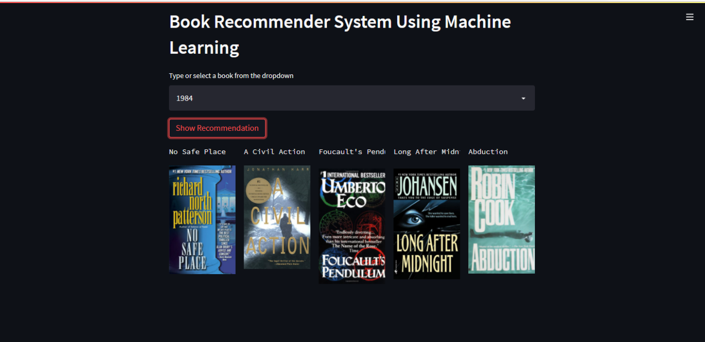

# 📚 Book Recommender System

**AI-Powered Book Discovery using Collaborative Filtering and Machine Learning**

[](https://streamlit.io/)
[](https://python.org/)
[](https://scikit-learn.org/)

> Discover your next favorite book with personalized recommendations powered by collaborative filtering algorithms trained on over 1 million user ratings.



## ✨ Features

- **🤖 AI-Powered Recommendations**: Uses k-Nearest Neighbors with cosine similarity
- **📚 Massive Dataset**: Trained on 271,379 books with 1.1M+ user ratings
- **🎨 Beautiful Interface**: Clean Streamlit web application with book covers
- **⚡ Real-time Results**: Instant recommendations with optimized performance
- **🔍 Smart Search**: Type-ahead book search with thousands of titles
- **📱 Responsive Design**: Works seamlessly on desktop and mobile

## 🚀 Quick Start

Get up and running in under 5 minutes:

```bash
# Clone the repository
git clone https://github.com/MELLOxProg/Books-Recommender-System.git
cd Books-Recommender-System

# Install dependencies
pip install -r requirements.txt

# Run the application
streamlit run app.py
```

Open your browser to `http://localhost:8501` and start discovering books!

## 📖 How It Works

The system employs **collaborative filtering** to analyze user behavior patterns:

1. **Data Processing**: Filters books with 50+ ratings and users with 200+ ratings
2. **Matrix Creation**: Builds user-item interaction matrices
3. **Similarity Calculation**: Uses cosine similarity to find similar books
4. **Recommendation Generation**: Returns 5 most similar books with covers


## 🛠️ Technology Stack

- **Frontend**: Streamlit for interactive web interface
- **Machine Learning**: Scikit-learn, NumPy, Pandas
- **Data Processing**: Jupyter Notebooks
- **Dataset**: Book Crossing Dataset (Kaggle)
- **Deployment**: Streamlit Cloud, Heroku, Docker

## 📊 Dataset Information

- **271,379** unique books with metadata
- **278,858** registered users
- **1,149,780** user ratings and interactions
- **Quality Filtering**: Only books with 50+ ratings, users with 200+ ratings
- **Rich Metadata**: Authors, publishers, publication years, cover images

## 🏗️ Project Structure

```
Books-Recommender-System/
├── app.py                    # Main Streamlit application
├── Books Recommender.ipynb   # ML training notebook
├── artifacts/                # Pre-trained models
│   ├── model.pkl            # k-NN recommendation model
│   ├── book_names.pkl       # Available book titles
│   ├── book_pivot.pkl       # User-item matrix
│   └── final_rating.pkl     # Processed rating data
├── data/                    # Raw datasets
├── demo/                    # Screenshots and demos
├── docs/                    # Comprehensive documentation
└── requirements.txt         # Python dependencies
```

## 🌐 Deployment Options

Choose from multiple deployment platforms:

| Platform | Best For | Features |
|----------|----------|----------|
| **Streamlit Cloud** | Quick demos | Free tier, GitHub integration |
| **Heroku** | Production apps | Scalable, professional hosting |
| **Docker** | Containerized | Platform independent, DevOps |
| **Self-hosted** | Custom needs | Full control, cost effective |

## 📚 Documentation

Comprehensive documentation is available with detailed guides:

- **[Quick Start Guide](docs/quickstart.mdx)** - Get running in minutes
- **[Installation Guide](docs/installation.mdx)** - Detailed setup instructions
- **[User Guide](docs/using-the-app.mdx)** - How to use the application
- **[Technical Deep Dive](docs/collaborative-filtering.mdx)** - ML concepts and algorithms
- **[API Reference](docs/api-reference/introduction.mdx)** - Function documentation
- **[Deployment Guides](docs/deployment/overview.mdx)** - Deploy to various platforms

## 🎯 Use Cases

Perfect for:

- **Personal Reading Discovery**: Find books matching your taste
- **Educational Projects**: Learn collaborative filtering concepts  
- **Portfolio Demonstrations**: Showcase ML and web development skills
- **Research**: Study recommendation system algorithms
- **Book Clubs**: Discover group reading suggestions

## 🤝 Contributing

We welcome contributions! Here's how to get started:

1. **Fork the repository**
2. **Create a feature branch**: `git checkout -b feature/amazing-feature`
3. **Make your changes** and test thoroughly
4. **Commit**: `git commit -m 'Add amazing feature'`
5. **Push**: `git push origin feature/amazing-feature`
6. **Open a Pull Request**

## 📈 Performance

- **Model Loading**: ~2-3 seconds initial startup
- **Recommendations**: Sub-second response times
- **Memory Usage**: ~500MB RAM for full models
- **Scalability**: Handles concurrent users efficiently
- **Dataset**: Processes millions of ratings seamlessly

## 🔧 Development

### Prerequisites

- Python 3.7+ (3.9+ recommended)
- 4GB+ RAM (8GB+ recommended)
- Git for version control

### Development Setup

```bash
# Create virtual environment
python -m venv book-recommender
source book-recommender/bin/activate  # or activate.bat on Windows

# Install in development mode
pip install -e .
pip install jupyter matplotlib seaborn

# Run development server
streamlit run app.py --server.runOnSave=true
```

### Model Training

If you need to retrain models:

```bash
# Start Jupyter notebook
jupyter notebook "Books Recommender.ipynb"

# Execute all cells to:
# 1. Load and preprocess data
# 2. Apply filtering criteria  
# 3. Train k-NN model
# 4. Generate pickle files
```

## 🌟 Screenshots

### Application Interface


## 🙏 Acknowledgments

- **Book Crossing Dataset**: Cai-Nicolas Ziegler, Sean M. McNee, Joseph A. Konstan, Georg Lausen
- **Streamlit**: For the amazing web framework
- **Scikit-learn**: For machine learning algorithms
- **Contributors**: Everyone who has contributed to this project
