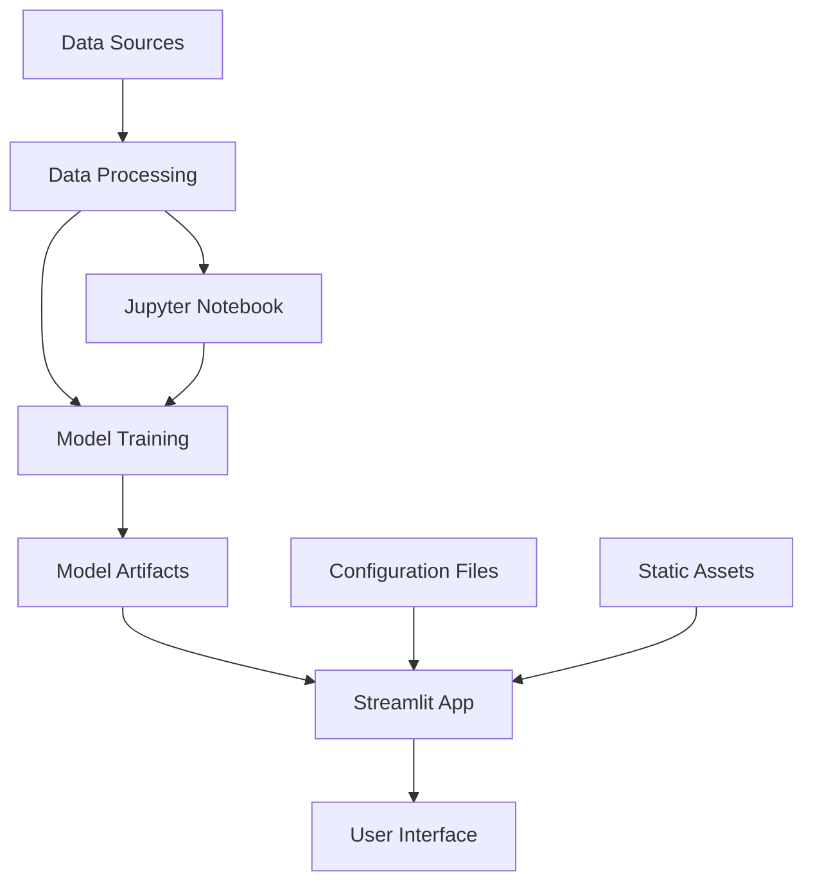

## Development Environment

Set up your development environment to contribute to or customize the Book Recommender System.

### Local Development Setup

<Steps>
  <Step title="Fork and Clone">
    ```bash
    git clone https://github.com/yourusername/book-recommender-system.git
    cd book-recommender-system
    ```
  </Step>
  
  <Step title="Install Development Dependencies">
    ```bash
    pip install -r requirements.txt
    pip install jupyter matplotlib seaborn scikit-learn pandas
    ```
  </Step>
  
  <Step title="Set up Pre-commit Hooks (Optional)">
    ```bash
    pip install pre-commit
    pre-commit install
    ```
  </Step>
</Steps>

### Project Architecture

The Book Recommender System follows a modular architecture:



## Code Structure

### Core Components

<AccordionGroup>
  <Accordion title="app.py - Main Application">
    The Streamlit web application that serves the user interface:
    
    ```python path=/app.py start=1
    '''
    Book Recommender System - Streamlit Application
    '''
    import pickle
    import streamlit as st
    import numpy as np

    # Load pre-trained models
    model = pickle.load(open('artifacts/model.pkl','rb'))
    book_names = pickle.load(open('artifacts/book_names.pkl','rb'))
    final_rating = pickle.load(open('artifacts/final_rating.pkl','rb'))
    book_pivot = pickle.load(open('artifacts/book_pivot.pkl','rb'))
    ```

    Key functions:
    - `fetch_poster()` - Retrieves book cover URLs
    - `recommend_book()` - Generates recommendations using k-NN
  </Accordion>

  <Accordion title="Books Recommender.ipynb - Model Training">
    Jupyter notebook containing the complete ML pipeline:
    
    - **Data Loading**: Reads BX dataset files
    - **Data Cleaning**: Handles missing values and outliers
    - **Feature Engineering**: Creates user-item matrices
    - **Model Training**: Trains k-Nearest Neighbors model
    - **Model Serialization**: Saves trained models as pickle files
  </Accordion>

  <Accordion title="artifacts/ - Model Storage">
    Contains serialized model components:
    
    - `model.pkl` - Trained k-NN model (182KB)
    - `book_names.pkl` - Available book titles (20KB)
    - `book_pivot.pkl` - User-item interaction matrix (5.3MB)
    - `final_rating.pkl` - Processed ratings data (3.8MB)
  </Accordion>

  <Accordion title="data/ - Training Data">
    Book Crossing dataset files:
    
    - `BX-Books.csv` - Book metadata (77MB)
    - `BX-Users.csv` - User information (12MB)
    - `BX-Book-Ratings.csv` - User ratings (30MB)
  </Accordion>
</AccordionGroup>

## Customization Guide

### Modifying the Recommendation Algorithm

To customize the recommendation engine:

<Tabs>
  <Tab title="Change k-NN Parameters">
    ```python
    from sklearn.neighbors import NearestNeighbors
    
    # In the notebook, modify these parameters:
    model = NearestNeighbors(
        n_neighbors=10,     # Change number of neighbors
        algorithm='brute',  # Try 'ball_tree' or 'kd_tree'
        metric='cosine'     # Try 'euclidean' or 'manhattan'
    )
    ```
  </Tab>

  <Tab title="Add Content-Based Features">
    ```python
    # Add book genre or author similarity
    from sklearn.feature_extraction.text import TfidfVectorizer
    from sklearn.metrics.pairwise import cosine_similarity
    
    # Create content features
    tfidf = TfidfVectorizer(stop_words='english')
    book_features = tfidf.fit_transform(books['Book-Author'] + ' ' + books['Publisher'])
    
    # Combine with collaborative filtering
    content_similarity = cosine_similarity(book_features)
    ```
  </Tab>

  <Tab title="Hybrid Approach">
    ```python
    # Combine collaborative and content-based recommendations
    def hybrid_recommend(book_name, alpha=0.7):
        # Get collaborative recommendations
        collab_recs = collaborative_recommend(book_name)
        
        # Get content-based recommendations  
        content_recs = content_recommend(book_name)
        
        # Combine with weighted average
        final_scores = alpha * collab_recs + (1-alpha) * content_recs
        return final_scores
    ```
  </Tab>
</Tabs>

### Enhancing the User Interface

Customize the Streamlit interface:

<CodeGroup>

```python Enhanced UI Features
# Add rating input
user_rating = st.slider("Rate this book", 1, 5, 3)

# Add genre filter
genres = st.multiselect("Select preferred genres", 
                       ['Fiction', 'Non-Fiction', 'Mystery', 'Romance'])

# Add multiple book input
selected_books = st.multiselect("Select multiple books you liked", book_names)
```

```python Custom Styling
# Add custom CSS
st.markdown("""
<style>
    .recommendation-card {
        background-color: #f0f2f6;
        padding: 1rem;
        border-radius: 0.5rem;
        margin: 0.5rem 0;
    }
</style>
""", unsafe_allow_html=True)
```

```python Advanced Features
# Add book details modal
if st.button(f"Details for {book_title}"):
    with st.expander(f"{book_title} - Details"):
        st.write(f"Author: {book_author}")
        st.write(f"Publisher: {book_publisher}")
        st.write(f"Average Rating: {avg_rating}")
```

</CodeGroup>

### Adding New Data Sources

To incorporate additional datasets:

<Steps>
  <Step title="Data Integration">
    ```python
    # Load additional book metadata
    goodreads_data = pd.read_csv('goodreads_books.csv')
    
    # Merge with existing data
    enhanced_books = books.merge(goodreads_data, on='ISBN', how='left')
    ```
  </Step>

  <Step title="Feature Engineering">
    ```python
    # Add new features
    enhanced_books['publication_decade'] = enhanced_books['Year-Of-Publication'] // 10 * 10
    enhanced_books['author_popularity'] = enhanced_books.groupby('Book-Author')['ISBN'].transform('count')
    ```
  </Step>

  <Step title="Model Retraining">
    ```python
    # Update the training pipeline
    book_pivot_enhanced = enhanced_books.pivot_table(
        index='Book-Title',
        columns='User-ID',
        values='Book-Rating'
    ).fillna(0)
    
    # Retrain model with enhanced features
    model_enhanced = NearestNeighbors(n_neighbors=6, algorithm='brute', metric='cosine')
    model_enhanced.fit(book_pivot_enhanced)
    ```
  </Step>
</Steps>

## Testing

### Unit Testing

Create test files for core functionality:

```python path=null start=null
# test_recommender.py
import unittest
import pickle
import numpy as np
from app import recommend_book, fetch_poster

class TestRecommender(unittest.TestCase):
    
    def setUp(self):
        # Load test data
        self.model = pickle.load(open('artifacts/model.pkl', 'rb'))
        self.book_names = pickle.load(open('artifacts/book_names.pkl', 'rb'))
    
    def test_recommend_book(self):
        # Test with known book
        recommendations, posters = recommend_book("Harry Potter and the Philosopher's Stone")
        
        self.assertEqual(len(recommendations), 6)  # Including the input book
        self.assertEqual(len(posters), 6)
        self.assertIsInstance(recommendations, list)
    
    def test_fetch_poster(self):
        # Test poster URL retrieval
        suggestion = [[0, 1, 2, 3, 4, 5]]
        posters = fetch_poster(suggestion)
        
        self.assertIsInstance(posters, list)
        self.assertTrue(all(isinstance(url, str) for url in posters))

if __name__ == '__main__':
    unittest.main()
```

### Integration Testing

Test the complete pipeline:

```python path=null start=null
# test_integration.py
def test_end_to_end_recommendation():
    """Test the complete recommendation flow"""
    
    # Test data loading
    assert os.path.exists('artifacts/model.pkl')
    assert os.path.exists('artifacts/book_names.pkl')
    
    # Test model loading
    model = pickle.load(open('artifacts/model.pkl', 'rb'))
    book_names = pickle.load(open('artifacts/book_names.pkl', 'rb'))
    
    # Test recommendation generation
    test_book = book_names[0]  # First book in the list
    recommendations, posters = recommend_book(test_book)
    
    assert len(recommendations) == 6
    assert len(posters) == 6
    assert test_book in recommendations  # Input book should be in results
```

## Performance Optimization

### Model Optimization

<AccordionGroup>
  <Accordion title="Memory Optimization">
    ```python
    # Use sparse matrices for large datasets
    from scipy.sparse import csr_matrix
    
    book_pivot_sparse = csr_matrix(book_pivot.values)
    
    # Use float32 instead of float64
    book_pivot = book_pivot.astype('float32')
    ```
  </Accordion>

  <Accordion title="Speed Optimization">
    ```python
    # Pre-compute similarities for popular books
    popular_books = book_ratings.groupby('Book-Title').size().nlargest(1000).index
    precomputed_similarities = {}
    
    for book in popular_books:
        similarities = model.kneighbors(book_pivot.loc[book].values.reshape(1, -1))
        precomputed_similarities[book] = similarities
    ```
  </Accordion>

  <Accordion title="Caching">
    ```python
    # Add caching to expensive operations
    from functools import lru_cache
    
    @lru_cache(maxsize=1000)
    def cached_recommend_book(book_name):
        return recommend_book(book_name)
    ```
  </Accordion>
</AccordionGroup>

## Deployment Considerations

### Environment Variables

Use environment variables for configuration:

```python path=null start=null
import os

# Configuration
MODEL_PATH = os.getenv('MODEL_PATH', 'artifacts/')
DATA_PATH = os.getenv('DATA_PATH', 'data/')
DEBUG = os.getenv('DEBUG', 'False').lower() == 'true'

# Load models with error handling
try:
    model = pickle.load(open(f'{MODEL_PATH}model.pkl', 'rb'))
except FileNotFoundError:
    st.error("Model files not found. Please run the training notebook first.")
```

### Health Checks

Add health check endpoints:

```python path=null start=null
def health_check():
    """Verify all model components are loaded"""
    checks = {
        'model': model is not None,
        'book_names': len(book_names) > 0,
        'book_pivot': book_pivot.shape[0] > 0,
        'final_rating': len(final_rating) > 0
    }
    
    return all(checks.values()), checks
```

## Contributing

### Code Standards

Follow these guidelines when contributing:

- Use meaningful variable names
- Add docstrings to functions
- Follow PEP 8 style guidelines
- Include type hints where appropriate
- Write unit tests for new features

### Pull Request Process

1. Fork the repository
2. Create a feature branch
3. Make your changes
4. Add tests for new functionality
5. Update documentation
6. Submit a pull request

<Note>
  Before submitting a PR, ensure all tests pass and the code follows the project's style guidelines.
</Note>