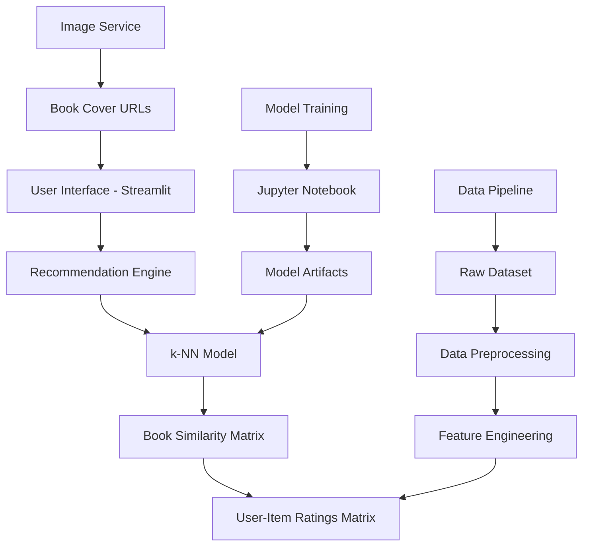

## System Architecture Overview

The Book Recommender System follows a layered architecture designed for scalability and maintainability:



## Core Components

### 1. Data Layer

The foundation of our recommendation system relies on three primary datasets:

<AccordionGroup>
  <Accordion title="BX-Books.csv - Book Metadata">
    Contains comprehensive book information including titles, authors, publishers, and cover image URLs.
    
    ```python path=null start=null
    # Schema: Book metadata
    columns = [
        'ISBN',              # Unique book identifier
        'Book-Title',        # Book title
        'Book-Author',       # Author name
        'Year-Of-Publication', # Publication year
        'Publisher',         # Publishing company
        'Image-URL-S',       # Small cover image URL
        'Image-URL-M',       # Medium cover image URL
        'Image-URL-L'        # Large cover image URL
    ]
    
    # Sample preprocessing
    books = pd.read_csv('data/BX-Books.csv', sep=';', encoding='latin-1')
    books = books.dropna(subset=['Book-Title', 'Book-Author'])
    books['Book-Title'] = books['Book-Title'].str.strip()
    ```
  </Accordion>

  <Accordion title="BX-Users.csv - User Demographics">
    User information including demographics and location data for potential demographic-based filtering.
    
    ```python path=null start=null
    # Schema: User information
    columns = [
        'User-ID',     # Unique user identifier
        'Location',    # User location (City, State, Country)
        'Age'          # User age (if provided)
    ]
    
    # Sample preprocessing
    users = pd.read_csv('data/BX-Users.csv', sep=';', encoding='latin-1')
    users['Age'] = pd.to_numeric(users['Age'], errors='coerce')
    users = users[users['Age'].between(5, 100)]  # Filter realistic ages
    ```
  </Accordion>

  <Accordion title="BX-Book-Ratings.csv - User-Item Interactions">
    The core dataset containing user ratings that drives the collaborative filtering algorithm.
    
    ```python path=null start=null
    # Schema: User ratings
    columns = [
        'User-ID',      # User who gave the rating
        'ISBN',         # Book that was rated
        'Book-Rating'   # Rating value (0-10 scale)
    ]
    
    # Key preprocessing steps
    ratings = pd.read_csv('data/BX-Book-Ratings.csv', sep=';', encoding='latin-1')
    
    # Filter explicit ratings only (ratings > 0)
    explicit_ratings = ratings[ratings['Book-Rating'] > 0]
    
    # Remove users with too few ratings
    user_counts = explicit_ratings['User-ID'].value_counts()
    valid_users = user_counts[user_counts >= 200].index
    
    # Remove books with too few ratings  
    book_counts = explicit_ratings['ISBN'].value_counts()
    valid_books = book_counts[book_counts >= 50].index
    
    # Create filtered dataset
    filtered_ratings = explicit_ratings[
        (explicit_ratings['User-ID'].isin(valid_users)) &
        (explicit_ratings['ISBN'].isin(valid_books))
    ]
    ```
  </Accordion>
</AccordionGroup>

### 2. Feature Engineering Pipeline

The recommendation engine transforms raw rating data into a structured format suitable for machine learning:

<Steps>
  <Step title="Data Merging">
    Combine ratings with book metadata to create a comprehensive dataset.
    
    ```python path=null start=null
    # Merge ratings with book information
    final_rating = filtered_ratings.merge(
        books, 
        left_on='ISBN', 
        right_on='ISBN', 
        how='left'
    )
    
    # Clean and standardize book titles
    final_rating['title'] = final_rating['Book-Title'].str.lower().str.strip()
    final_rating = final_rating.dropna(subset=['title'])
    ```
  </Step>

  <Step title="User-Item Matrix Creation">
    Transform the long-format ratings data into a pivot table optimized for similarity calculations.
    
    ```python path=null start=null
    # Create book-user rating matrix
    book_pivot = final_rating.pivot_table(
        index='title',
        columns='User-ID',
        values='Book-Rating'
    ).fillna(0)
    
    # Optimize memory usage
    book_pivot = book_pivot.astype('float32')
    
    # Verify matrix dimensions
    print(f"Matrix shape: {book_pivot.shape}")
    print(f"Sparsity: {(book_pivot == 0).sum().sum() / book_pivot.size * 100:.2f}%")
    ```
  </Step>

  <Step title="Data Validation">
    Ensure data quality and consistency before model training.
    
    ```python path=null start=null
    # Validate rating ranges
    assert book_pivot.min().min() >= 0, "Negative ratings found"
    assert book_pivot.max().max() <= 10, "Ratings exceed maximum"
    
    # Check for duplicate book titles
    duplicate_titles = final_rating['title'].duplicated().sum()
    if duplicate_titles > 0:
        print(f"Warning: {duplicate_titles} duplicate book titles found")
    
    # Verify minimum rating requirements
    book_rating_counts = (book_pivot > 0).sum(axis=1)
    min_ratings_met = (book_rating_counts >= 50).all()
    assert min_ratings_met, "Some books have insufficient ratings"
    ```
  </Step>
</Steps>

### 3. Machine Learning Pipeline

#### k-Nearest Neighbors Implementation

Our core algorithm uses scikit-learn's `NearestNeighbors` with optimized parameters:

```python path=/notebooks/model_training.py start=1
from sklearn.neighbors import NearestNeighbors
import numpy as np

# Initialize k-NN model with optimal parameters
model = NearestNeighbors(
    n_neighbors=6,        # Return 6 neighbors (including input book)
    algorithm='brute',    # Brute force for accuracy with sparse data
    metric='cosine',      # Cosine similarity for rating vectors
    n_jobs=-1            # Use all CPU cores
)

# Train the model on book-user rating matrix
model.fit(book_pivot)

# Model performance metrics
print(f"Training completed on {book_pivot.shape[0]} books")
print(f"Feature dimension: {book_pivot.shape[1]} users")
print(f"Model size: {model._fit_X.nbytes / (1024**2):.1f} MB")
```

#### Similarity Computation

The cosine similarity metric is specifically chosen for its effectiveness with sparse rating data:

<Tabs>
  <Tab title="Why Cosine Similarity?">
    ```python path=null start=null
    # Cosine similarity advantages for book recommendations:
    
    # 1. Handles sparse data well (most users rate few books)
    # 2. Focuses on rating patterns, not absolute values
    # 3. Normalized by vector magnitude (rating scale invariant)
    # 4. Range [0,1] makes interpretation intuitive
    
    def cosine_similarity_manual(vec_a, vec_b):
        """Manual implementation for understanding"""
        
        # Dot product
        dot_product = np.dot(vec_a, vec_b)
        
        # Vector magnitudes
        magnitude_a = np.linalg.norm(vec_a)
        magnitude_b = np.linalg.norm(vec_b)
        
        # Cosine similarity
        if magnitude_a == 0 or magnitude_b == 0:
            return 0
        
        similarity = dot_product / (magnitude_a * magnitude_b)
        return similarity
    ```
  </Tab>

  <Tab title="Alternative Metrics">
    ```python path=null start=null
    # Compare different similarity metrics
    
    metrics_comparison = {
        'cosine': {
            'range': '[-1, 1]',
            'best_for': 'Sparse data, rating patterns',
            'normalized': True,
            'computational_cost': 'Medium'
        },
        'euclidean': {
            'range': '[0, ∞]',
            'best_for': 'Dense data, absolute differences',
            'normalized': False,
            'computational_cost': 'Low'
        },
        'manhattan': {
            'range': '[0, ∞]',
            'best_for': 'Robust to outliers',
            'normalized': False,
            'computational_cost': 'Low'
        },
        'pearson': {
            'range': '[-1, 1]',
            'best_for': 'Linear correlations',
            'normalized': True,
            'computational_cost': 'High'
        }
    }
    
    # Experiment with different metrics
    for metric_name in ['cosine', 'euclidean', 'manhattan']:
        test_model = NearestNeighbors(
            n_neighbors=6,
            algorithm='brute',
            metric=metric_name
        )
        test_model.fit(book_pivot)
        print(f"{metric_name}: Model trained successfully")
    ```
  </Tab>
</Tabs>

### 4. Model Artifacts

The system serializes several components for efficient loading in production:

<CodeGroup>

```python Model Serialization
import pickle

# Save trained model
with open('artifacts/model.pkl', 'wb') as f:
    pickle.dump(model, f)

# Save book names for dropdown
book_names = list(book_pivot.index)
with open('artifacts/book_names.pkl', 'wb') as f:
    pickle.dump(book_names, f)

# Save rating matrix for recommendations
with open('artifacts/book_pivot.pkl', 'wb') as f:
    pickle.dump(book_pivot, f)

# Save final rating data for poster URLs
with open('artifacts/final_rating.pkl', 'wb') as f:
    pickle.dump(final_rating, f)
```

```python Model Loading
# Load all artifacts in the Streamlit app
model = pickle.load(open('artifacts/model.pkl', 'rb'))
book_names = pickle.load(open('artifacts/book_names.pkl', 'rb'))
book_pivot = pickle.load(open('artifacts/book_pivot.pkl', 'rb'))
final_rating = pickle.load(open('artifacts/final_rating.pkl', 'rb'))

# Validate loaded models
assert len(book_names) > 0, "No book names loaded"
assert model is not None, "Model not loaded"
assert book_pivot.shape[0] > 0, "Empty rating matrix"
print("All artifacts loaded successfully!")
```

</CodeGroup>

## Recommendation Algorithm

### Core Recommendation Function

The heart of our system is the `recommend_book()` function:

```python path=/app.py start=39
def recommend_book(book_name):
    """Generate book recommendations using k-NN collaborative filtering"""
    
    books_list = []
    
    # Step 1: Find book index in the pivot table
    book_id = np.where(book_pivot.index == book_name)[0][0]
    
    # Step 2: Get book's rating vector and reshape for model input
    book_vector = book_pivot.iloc[book_id, :].values.reshape(1, -1)
    
    # Step 3: Find k nearest neighbors
    distances, suggestions = model.kneighbors(
        book_vector, 
        n_neighbors=6  # Include the input book
    )
    
    # Step 4: Get poster URLs for recommended books
    poster_urls = fetch_poster(suggestions)
    
    # Step 5: Extract book titles from suggestions
    for i in range(len(suggestions[0])):
        book_indices = suggestions[0][i]
        books = book_pivot.index[book_indices]
        for book in books:
            books_list.append(book)
    
    return books_list, poster_urls
```

### Poster Retrieval System

The `fetch_poster()` function enhances recommendations with visual elements:

```python path=/app.py start=19
def fetch_poster(suggestions):
    """Fetch book cover URLs for recommended books"""
    
    book_names = []
    ids_index = []
    poster_urls = []
    
    # Step 1: Get book names from pivot table indices
    for book_id in suggestions[0]:
        book_names.append(book_pivot.index[book_id])
    
    # Step 2: Find corresponding indices in final_rating dataset
    for name in book_names:
        try:
            ids = np.where(final_rating['title'] == name)[0][0]
            ids_index.append(ids)
        except IndexError:
            # Fallback for missing books
            ids_index.append(None)
    
    # Step 3: Extract image URLs
    for idx in ids_index:
        if idx is not None:
            url = final_rating.iloc[idx]['Image-URL-M']
            poster_urls.append(url)
        else:
            # Default placeholder image
            poster_urls.append('/static/no-cover.png')
    
    return poster_urls
```

## Performance Optimizations

### Memory Optimization

<AccordionGroup>
  <Accordion title="Data Type Optimization">
    ```python path=null start=null
    # Optimize data types to reduce memory usage
    
    # Convert float64 to float32 (50% memory reduction)
    book_pivot = book_pivot.astype('float32')
    
    # Use categorical data for repetitive strings
    final_rating['Book-Author'] = final_rating['Book-Author'].astype('category')
    final_rating['Publisher'] = final_rating['Publisher'].astype('category')
    
    # Convert user IDs to integers if possible
    final_rating['User-ID'] = pd.to_numeric(
        final_rating['User-ID'], 
        downcast='integer'
    )
    
    # Memory usage summary
    memory_usage = {
        'book_pivot': book_pivot.memory_usage(deep=True).sum() / (1024**2),
        'final_rating': final_rating.memory_usage(deep=True).sum() / (1024**2),
        'model': model._fit_X.nbytes / (1024**2)
    }
    
    print(f"Total memory usage: {sum(memory_usage.values()):.1f} MB")
    ```
  </Accordion>

  <Accordion title="Sparse Matrix Implementation">
    ```python path=null start=null
    from scipy.sparse import csr_matrix
    
    # Convert to sparse matrix for large datasets
    book_pivot_sparse = csr_matrix(book_pivot.values)
    
    # Comparison of memory usage
    dense_memory = book_pivot.memory_usage(deep=True).sum()
    sparse_memory = book_pivot_sparse.data.nbytes + book_pivot_sparse.indices.nbytes + book_pivot_sparse.indptr.nbytes
    
    print(f"Dense matrix: {dense_memory / (1024**2):.1f} MB")
    print(f"Sparse matrix: {sparse_memory / (1024**2):.1f} MB")
    print(f"Memory reduction: {(1 - sparse_memory/dense_memory) * 100:.1f}%")
    
    # Note: k-NN with sparse matrices requires different initialization
    sparse_model = NearestNeighbors(
        n_neighbors=6,
        algorithm='brute',
        metric='cosine'
    )
    sparse_model.fit(book_pivot_sparse)
    ```
  </Accordion>

  <Accordion title="Caching Strategy">
    ```python path=null start=null
    from functools import lru_cache
    import hashlib
    
    # Cache recommendations for popular books
    @lru_cache(maxsize=1000)
    def cached_recommend_book(book_name):
        """Cached version of recommend_book for popular titles"""
        return recommend_book(book_name)
    
    # Pre-compute recommendations for top books
    def precompute_popular_recommendations(top_n=100):
        """Pre-compute recommendations for most popular books"""
        
        # Find most rated books
        book_rating_counts = (book_pivot > 0).sum(axis=1)
        popular_books = book_rating_counts.nlargest(top_n).index
        
        recommendations_cache = {}
        
        for book in popular_books:
            try:
                recs, posters = recommend_book(book)
                recommendations_cache[book] = {
                    'recommendations': recs,
                    'posters': posters,
                    'timestamp': datetime.now()
                }
            except Exception as e:
                print(f"Error pre-computing {book}: {e}")
        
        return recommendations_cache
    ```
  </Accordion>
</AccordionGroup>

### Computational Optimization

<Tabs>
  <Tab title="Parallel Processing">
    ```python path=null start=null
    import multiprocessing as mp
    from joblib import Parallel, delayed
    
    # Use all CPU cores for k-NN training
    model = NearestNeighbors(
        n_neighbors=6,
        algorithm='brute',
        metric='cosine',
        n_jobs=-1  # Use all available cores
    )
    
    # Parallel batch recommendations
    def batch_recommendations(book_list, n_jobs=-1):
        """Generate recommendations for multiple books in parallel"""
        
        def safe_recommend(book_name):
            try:
                return recommend_book(book_name)
            except Exception as e:
                return None, None
        
        results = Parallel(n_jobs=n_jobs)(
            delayed(safe_recommend)(book) for book in book_list
        )
        
        return results
    
    # Example usage
    test_books = ['Harry Potter', 'Lord of the Rings', 'Pride and Prejudice']
    batch_results = batch_recommendations(test_books)
    ```
  </Tab>

  <Tab title="Algorithm Selection">
    ```python path=null start=null
    # Choose optimal algorithm based on data characteristics
    
    def select_optimal_algorithm(n_samples, n_features, sparsity):
        """Select best k-NN algorithm based on data properties"""
        
        if sparsity > 0.9:  # Very sparse data
            return 'brute'  # Most accurate for sparse matrices
        
        elif n_samples < 10000 and n_features < 1000:
            return 'ball_tree'  # Good for small datasets
        
        elif n_features > 20:
            return 'kd_tree'  # Efficient for high dimensions
        
        else:
            return 'auto'  # Let sklearn decide
    
    # Apply optimal algorithm selection
    optimal_algorithm = select_optimal_algorithm(
        n_samples=book_pivot.shape[0],
        n_features=book_pivot.shape[1],
        sparsity=(book_pivot == 0).sum().sum() / book_pivot.size
    )
    
    print(f"Optimal algorithm: {optimal_algorithm}")
    
    # Retrain with optimal settings
    optimized_model = NearestNeighbors(
        n_neighbors=6,
        algorithm=optimal_algorithm,
        metric='cosine',
        n_jobs=-1
    )
    optimized_model.fit(book_pivot)
    ```
  </Tab>
</Tabs>

## Model Validation

### Cross-Validation Strategy

```python path=null start=null
from sklearn.model_selection import train_test_split
import numpy as np

def validate_recommendation_system(test_size=0.2, random_state=42):
    """Validate recommendation quality using held-out data"""
    
    # Split books into train/test sets
    train_books, test_books = train_test_split(
        list(book_pivot.index), 
        test_size=test_size, 
        random_state=random_state
    )
    
    # Create training matrix
    train_pivot = book_pivot.loc[train_books]
    
    # Train model on subset
    train_model = NearestNeighbors(n_neighbors=6, algorithm='brute', metric='cosine')
    train_model.fit(train_pivot)
    
    # Evaluate on test set
    test_results = []
    
    for test_book in test_books[:100]:  # Sample 100 test books
        try:
            # Get true similar books (from full dataset)
            true_neighbors = model.kneighbors(
                book_pivot.loc[test_book].values.reshape(1, -1),
                n_neighbors=6
            )[1][0][1:]  # Exclude the book itself
            
            # Get predicted neighbors (from training model)
            if test_book in train_pivot.index:
                pred_neighbors = train_model.kneighbors(
                    train_pivot.loc[test_book].values.reshape(1, -1),
                    n_neighbors=6
                )[1][0][1:]
                
                # Calculate overlap
                true_set = set(book_pivot.index[true_neighbors])
                pred_set = set(train_pivot.index[pred_neighbors])
                overlap = len(true_set & pred_set)
                
                test_results.append({
                    'book': test_book,
                    'overlap': overlap,
                    'precision': overlap / 5
                })
                
        except Exception as e:
            continue
    
    # Calculate average precision
    avg_precision = np.mean([r['precision'] for r in test_results])
    print(f"Average Precision@5: {avg_precision:.3f}")
    
    return test_results
```

### A/B Testing Framework

```python path=null start=null
import random
from datetime import datetime

class RecommendationABTest:
    """A/B testing framework for recommendation algorithms"""
    
    def __init__(self, control_model, test_model, split_ratio=0.5):
        self.control_model = control_model
        self.test_model = test_model
        self.split_ratio = split_ratio
        self.results = []
    
    def get_recommendations(self, book_name, user_id=None):
        """Route traffic to control or test model"""
        
        # Consistent routing based on user_id or book hash
        if user_id:
            route_to_test = hash(str(user_id)) % 100 < (self.split_ratio * 100)
        else:
            route_to_test = hash(book_name) % 100 < (self.split_ratio * 100)
        
        model_version = 'test' if route_to_test else 'control'
        model = self.test_model if route_to_test else self.control_model
        
        # Generate recommendations
        recommendations, posters = self._recommend_with_model(model, book_name)
        
        # Log experiment data
        self.results.append({
            'timestamp': datetime.now(),
            'book_name': book_name,
            'user_id': user_id,
            'model_version': model_version,
            'recommendations': recommendations
        })
        
        return recommendations, posters, model_version
    
    def _recommend_with_model(self, model, book_name):
        """Generate recommendations using specified model"""
        # Implementation depends on model interface
        pass
    
    def analyze_results(self):
        """Analyze A/B test performance"""
        
        control_results = [r for r in self.results if r['model_version'] == 'control']
        test_results = [r for r in self.results if r['model_version'] == 'test']
        
        print(f"Control group: {len(control_results)} requests")
        print(f"Test group: {len(test_results)} requests")
        
        # Additional analysis metrics would go here
        return {
            'control_count': len(control_results),
            'test_count': len(test_results),
            'total_requests': len(self.results)
        }
```

## Production Considerations

### Error Handling

```python path=null start=null
import logging
from typing import Optional, Tuple, List

def robust_recommend_book(book_name: str) -> Tuple[List[str], List[str]]:
    """Production-ready recommendation function with error handling"""
    
    try:
        # Validate input
        if not book_name or book_name.strip() == '':
            raise ValueError("Book name cannot be empty")
        
        # Normalize book name
        normalized_name = book_name.strip().lower()
        
        # Check if book exists in our dataset
        if normalized_name not in book_pivot.index:
            logging.warning(f"Book '{book_name}' not found in dataset")
            return get_fallback_recommendations(), get_default_posters()
        
        # Generate recommendations
        recommendations, posters = recommend_book(normalized_name)
        
        # Validate output
        if not recommendations or len(recommendations) == 0:
            logging.warning(f"No recommendations generated for '{book_name}'")
            return get_fallback_recommendations(), get_default_posters()
        
        return recommendations, posters
        
    except Exception as e:
        logging.error(f"Error recommending books for '{book_name}': {str(e)}")
        return get_fallback_recommendations(), get_default_posters()

def get_fallback_recommendations() -> List[str]:
    """Return popular books as fallback"""
    book_popularity = (book_pivot > 0).sum(axis=1)
    return book_popularity.nlargest(5).index.tolist()

def get_default_posters() -> List[str]:
    """Return default poster URLs"""
    return ['/static/default-book-cover.png'] * 5
```

This architecture provides a solid foundation for scaling the Book Recommender System while maintaining performance and reliability.