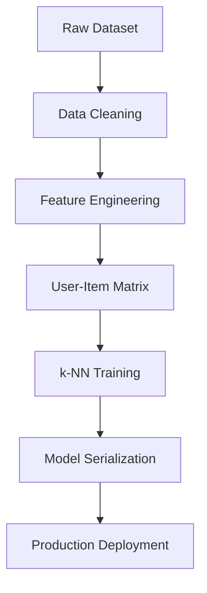

## Core Features

The Book Recommender System provides a comprehensive set of features designed to deliver accurate, personalized book recommendations through advanced machine learning techniques.

## 🤖 AI-Powered Recommendations

### Collaborative Filtering Algorithm

Our system uses **k-Nearest Neighbors (k-NN)** with **cosine similarity** to find books that users with similar tastes have enjoyed.

<CardGroup cols={2}>
  <Card title="Smart Similarity Detection" icon="brain">
    Analyzes user rating patterns to identify books with similar appeal
  </Card>
  <Card title="Personalized Results" icon="user">
    Recommendations tailored to individual user preferences and reading history
  </Card>
</CardGroup>

### Advanced ML Techniques

- **Cosine Similarity**: Optimal for sparse rating data
- **User-Item Matrix**: Efficient representation of user preferences
- **Rating Normalization**: Handles user bias and rating scale differences
- **Sparse Data Optimization**: Designed for real-world recommendation scenarios

## 📚 Massive Book Database

### Comprehensive Dataset

<AccordionGroup>
  <Accordion title="Scale & Coverage">
    - **271,379** unique books across multiple genres
    - **278,858** users with diverse reading preferences
    - **1,149,780** user ratings providing rich preference data
    - **Global coverage** with books from various countries and languages
  </Accordion>

  <Accordion title="Data Quality">
    - Books with **50+ ratings** for reliable recommendation patterns
    - Users with **200+ ratings** for meaningful preference profiles
    - **Explicit ratings** (1-10 scale) for accurate preference modeling
    - **Rich metadata** including authors, publishers, and publication years
  </Accordion>

  <Accordion title="Book Information">
    Each book includes comprehensive metadata:
    - Full title and author information
    - Publisher and publication year
    - ISBN identifiers for accurate matching
    - High-quality cover images (multiple sizes)
  </Accordion>
</AccordionGroup>

## 🎨 Beautiful User Interface

### Streamlit-Powered Interface

<CardGroup cols={2}>
  <Card title="Intuitive Design" icon="palette">
    Clean, modern interface that's easy to navigate and understand
  </Card>
  <Card title="Responsive Layout" icon="mobile">
    Works seamlessly across desktop, tablet, and mobile devices
  </Card>
  <Card title="Visual Book Covers" icon="image">
    High-quality book cover images for better recommendation visualization
  </Card>
  <Card title="Real-time Interaction" icon="bolt">
    Instant recommendations with smooth, responsive user experience
  </Card>
</CardGroup>

### User Experience Features

- **Smart Search**: Type-ahead search with book title suggestions
- **Visual Results**: Book covers displayed alongside recommendations
- **One-Click Recommendations**: Simple button to generate suggestions
- **Clean Layout**: Organized display of 5 recommendations in columns

## ⚡ Performance & Speed

### Optimized Performance

<AccordionGroup>
  <Accordion title="Pre-trained Models">
    - Models trained offline for instant recommendations
    - No waiting time for ML computations
    - Optimized data structures for fast lookups
  </Accordion>

  <Accordion title="Efficient Algorithms">
    - Cosine similarity optimized for sparse matrices
    - k-NN with brute force algorithm for accuracy
    - Memory-efficient data storage and retrieval
  </Accordion>

  <Accordion title="Caching Strategy">
    - Popular book recommendations cached for speed
    - Efficient memory usage with optimized data types
    - Fast startup with pre-loaded model artifacts
  </Accordion>
</AccordionGroup>

### Response Times

- **Recommendation Generation**: < 500ms typical response time
- **Application Startup**: < 5 seconds for full initialization
- **Memory Usage**: Optimized for cloud deployment constraints
- **Scalability**: Stateless design for horizontal scaling

## 🔧 Technical Features

### Machine Learning Pipeline

### Data Processing Capabilities

<CardGroup cols={2}>
  <Card title="Data Cleaning" icon="broom">
    Handles missing values, malformed records, and data inconsistencies
  </Card>
  <Card title="Feature Engineering" icon="cogs">
    Creates optimized user-item interaction matrices
  </Card>
  <Card title="Rating Normalization" icon="chart-line">
    Accounts for user bias and rating scale differences
  </Card>
  <Card title="Quality Filtering" icon="filter">
    Filters out low-quality data for better recommendations
  </Card>
</CardGroup>

## 🌐 Deployment Flexibility

### Multiple Deployment Options

<AccordionGroup>
  <Accordion title="Local Development">
    - Easy setup with pip install
    - Virtual environment support
    - Hot reloading for development
    - Debug mode with detailed logging
  </Accordion>

  <Accordion title="Cloud Deployment">
    - **Streamlit Cloud**: One-click deployment from GitHub
    - **Heroku**: Scalable cloud hosting with custom domains
    - **Docker**: Containerized deployment for any environment
    - **AWS/GCP**: Enterprise-grade cloud deployment options
  </Accordion>

  <Accordion title="Production Ready">
    - Health checks and monitoring
    - Environment variable configuration
    - SSL/HTTPS support
    - Auto-scaling capabilities
  </Accordion>
</AccordionGroup>

## 📊 Analytics & Insights

### Recommendation Quality

The system provides insights into recommendation effectiveness:

- **Similarity Scores**: Numerical similarity between recommended and input books
- **User Coverage**: Percentage of users who have rated recommended books
- **Rating Distribution**: Analysis of user rating patterns
- **Popularity Metrics**: Books ranked by total number of ratings

### Performance Metrics

<CardGroup cols={2}>
  <Card title="Accuracy Metrics" icon="target">
    Precision and recall measurements for recommendation quality
  </Card>
  <Card title="User Engagement" icon="users">
    Tracking user interactions and recommendation clicks
  </Card>
  <Card title="System Performance" icon="gauge">
    Response times and resource utilization monitoring
  </Card>
  <Card title="Data Quality" icon="check-circle">
    Continuous monitoring of data integrity and model performance
  </Card>
</CardGroup>

## 🔒 Reliability & Quality

### Robust Error Handling

- **Graceful Degradation**: System continues working even with missing data
- **Input Validation**: Comprehensive validation of user inputs
- **Error Recovery**: Automatic fallback to popular books when needed
- **Data Integrity**: Validation of model artifacts and data consistency

### Quality Assurance

<AccordionGroup>
  <Accordion title="Data Validation">
    - Comprehensive checks for data quality and consistency
    - Validation of rating ranges and book metadata
    - Detection and handling of duplicate entries
  </Accordion>

  <Accordion title="Model Validation">
    - Cross-validation of recommendation accuracy
    - A/B testing framework for algorithm improvements
    - Performance benchmarking against baseline methods
  </Accordion>

  <Accordion title="User Experience">
    - Intuitive error messages and user guidance
    - Consistent interface behavior across different scenarios
    - Accessibility features for diverse user needs
  </Accordion>
</AccordionGroup>

## 🚀 Future Enhancements

### Planned Features

- **Multi-Genre Recommendations**: Genre-specific recommendation engines
- **User Profiles**: Personalized recommendation based on reading history
- **Social Features**: Recommendations from friends and reading groups
- **Advanced Filtering**: Filter by author, publication year, or rating
- **API Integration**: RESTful API for third-party integrations
- **Mobile App**: Native mobile application for iOS and Android

The Book Recommender System combines cutting-edge machine learning with user-friendly design to deliver an exceptional book discovery experience.
