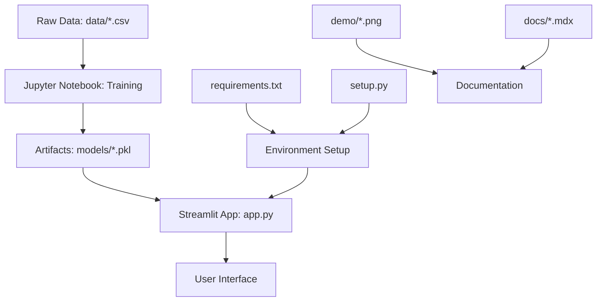

## 📁 Repository Overview

The Book Recommender System is organized into clear, logical sections for easy navigation and development. Here's the complete structure:

```
Books-Recommender-System/
├── 📱 Frontend Application
│   ├── app.py                    # Main Streamlit application
│   └── frontend1.png             # UI screenshot
│
├── 🤖 Machine Learning
│   ├── Books Recommender.ipynb   # Training notebook
│   ├── artifacts/                # Pre-trained models
│   │   ├── model.pkl            # k-NN recommendation model
│   │   ├── book_names.pkl       # Available book titles
│   │   ├── book_pivot.pkl       # User-item matrix
│   │   └── final_rating.pkl     # Processed rating data
│   └── src/                     # Source code modules
│       ├── __init__.py
│       └── utils/
│           └── __init__.py
│
├── 📊 Data
│   └── data/                    # Raw datasets
│       ├── BX-Books.csv         # Book metadata
│       ├── BX-Users.csv         # User demographics  
│       └── BX-Book-Ratings.csv  # User-book ratings
│
├── 📸 Demo Materials
│   └── demo/                    # Application screenshots
│       ├── 1.png               # Main interface
│       ├── 2.png               # Book selection
│       ├── 3.png               # Alternative interface
│       └── 6.jpeg              # Additional demo
│
├── 📚 Documentation
│   ├── docs/                    # Mintlify documentation
│   │   ├── *.mdx               # Documentation pages
│   │   ├── api-reference/       # API documentation
│   │   ├── deployment/          # Deployment guides
│   │   └── examples/            # Usage examples
│   └── mint.json               # Mintlify configuration
│
├── ⚙️ Configuration
│   ├── requirements.txt         # Python dependencies
│   ├── setup.py                # Package setup
│   ├── Procfile                # Heroku deployment
│   ├── setup.sh                # Streamlit configuration
│   └── .gitignore              # Git ignore rules
│
└── 📄 Project Files
    └── README.md               # Project overview (if present)
```

## 🔍 Detailed File Analysis

### Core Application Files

<AccordionGroup>
  <Accordion title="📱 app.py - Main Application">
    **Purpose**: The heart of the Streamlit web application
    
    **Key Functions**:
    ```python path=/C/Users/Nirav/Desktop/rs project/Books-Recommender-System/app.py start=10
    st.header('Book Recommender System Using Machine Learning')
    model = pickle.load(open('artifacts/model.pkl','rb'))
    book_names = pickle.load(open('artifacts/book_names.pkl','rb'))
    final_rating = pickle.load(open('artifacts/final_rating.pkl','rb'))
    book_pivot = pickle.load(open('artifacts/book_pivot.pkl','rb'))
    ```
    
    **Components**:
    - Model loading and initialization
    - User interface creation
    - Recommendation logic (`recommend_book()` function)
    - Image fetching (`fetch_poster()` function) 
    - Result display and formatting
    
    **Dependencies**: Streamlit, NumPy, Pickle
  </Accordion>

  <Accordion title="🤖 Books Recommender.ipynb - ML Training">
    **Purpose**: Complete machine learning pipeline for model training
    
    **Notebook Sections**:
    1. **Data Loading**: Import and explore datasets
    2. **Data Preprocessing**: Clean and filter data
    3. **Feature Engineering**: Create user-item matrices
    4. **Model Training**: Train k-NN collaborative filtering model
    5. **Model Evaluation**: Test and validate recommendations
    6. **Model Persistence**: Save trained artifacts
    
    **Key Libraries**: Pandas, NumPy, Scikit-learn, Matplotlib, Seaborn
    
    **Output**: Generates all files in `artifacts/` directory
  </Accordion>
</AccordionGroup>

### Data Structure

<AccordionGroup>
  <Accordion title="📊 data/ - Raw Datasets">
    **Book Crossing Dataset** from Kaggle containing:
    
    **BX-Books.csv** (271,379 records):
    ```csv
    ISBN,Book-Title,Book-Author,Year-Of-Publication,Publisher,Image-URL-S,Image-URL-M,Image-URL-L
    0195153448,Classical Mythology,Mark P. O. Morford,2002,Oxford University Press,...
    ```
    
    **BX-Users.csv** (278,858 records):
    ```csv
    User-ID,Location,Age
    1,nyc, new york, usa,
    2,stockton, california, usa,18
    ```
    
    **BX-Book-Ratings.csv** (1,149,780 records):
    ```csv
    User-ID,ISBN,Book-Rating
    276725,034545104X,0
    276726,0155061224,5
    ```
  </Accordion>

  <Accordion title="🤖 artifacts/ - Pre-trained Models">
    **Generated by the Jupyter notebook, essential for application runtime**:
    
    **model.pkl**: 
    - Trained k-NN model using scikit-learn
    - Configured with cosine similarity
    - Used for finding similar books
    
    **book_names.pkl**:
    - List of all available book titles
    - Powers the dropdown selection interface
    - Filtered for quality (50+ ratings minimum)
    
    **book_pivot.pkl**:
    - User-item interaction matrix
    - Books as rows, users as columns
    - Sparse matrix for memory efficiency
    
    **final_rating.pkl**:
    - Processed and cleaned rating data
    - Includes book metadata and cover URLs
    - Used for recommendation display
  </Accordion>
</AccordionGroup>

### Development Structure

<AccordionGroup>
  <Accordion title="🏗️ src/ - Source Code Modules">
    **Package Structure**:
    ```
    src/
    ├── __init__.py          # Package initialization
    └── utils/               # Utility functions
        └── __init__.py      # Utils initialization
    ```
    
    **Purpose**: 
    - Modular code organization for development
    - Reusable utility functions
    - Package-based imports
    - Future extensibility
    
    **Installation**: Installed via `pip install -e .`
  </Accordion>

  <Accordion title="📸 demo/ - Visual Assets">
    **Screenshot Collection**:
    - **1.png**: Main application interface showing recommendations
    - **2.png**: Book selection dropdown interface
    - **3.png**: Alternative view of the recommendation system
    - **6.jpeg**: Additional demonstration screenshot
    
    **Usage**:
    - Documentation illustrations
    - Demo and presentation materials
    - UI/UX reference for developers
    - Marketing and showcase content
  </Accordion>
</AccordionGroup>

### Configuration Files

<AccordionGroup>
  <Accordion title="⚙️ requirements.txt - Dependencies">
    **Current Dependencies**:
    ```txt path=/C/Users/Nirav/Desktop/rs project/Books-Recommender-System/requirements.txt start=1
    ### dependency
    streamlit
    numpy
    
    ### local packages -
    -e . 
    ```
    
    **Purpose**:
    - Defines Python package requirements
    - Ensures consistent environments
    - Enables easy installation via `pip install -r requirements.txt`
    - Includes local package in editable mode
  </Accordion>

  <Accordion title="📦 setup.py - Package Configuration">
    **Package Metadata**:
    ```python path=/C/Users/Nirav/Desktop/rs project/Books-Recommender-System/setup.py start=7
    REPO_NAME = "Books-Recommender-System-Using-Machine-Learning"
    AUTHOR_USER_NAME = "MELLOxProg"
    SRC_REPO = "src"
    LIST_OF_REQUIREMENTS = ['streamlit', 'numpy']
    ```
    
    **Configuration**:
    - Package name and version information
    - Author details and repository links
    - Dependency management
    - Installation instructions
  </Accordion>

  <Accordion title="🚀 Deployment Files">
    **Procfile** (Heroku):
    ```txt path=/C/Users/Nirav/Desktop/rs project/Books-Recommender-System/Procfile start=1
    web: sh setup.sh && streamlit run app.py
    ```
    
    **setup.sh** (Streamlit Configuration):
    - Server configuration for deployment
    - Port and host settings
    - Production optimizations
    
    **Purpose**: Enable one-click deployment to cloud platforms
  </Accordion>
</AccordionGroup>

## 🔗 File Dependencies

### Runtime Dependencies

<Steps>
  <Step title="Application Startup">
    `app.py` loads pre-trained models from `artifacts/`
    ```python path=null start=null
    # Critical files loaded at startup
    model.pkl → recommendation_engine
    book_names.pkl → dropdown_options
    book_pivot.pkl → similarity_matrix
    final_rating.pkl → metadata_lookup
    ```
  </Step>
  
  <Step title="Model Training Pipeline">
    `Books Recommender.ipynb` processes raw data to create artifacts
    ```python path=null start=null
    # Training pipeline flow
    data/*.csv → preprocessing → model_training → artifacts/*.pkl
    ```
  </Step>
  
  <Step title="Package Installation">
    `setup.py` and `requirements.txt` manage dependencies
    ```python path=null start=null
    # Installation chain
    setup.py → package_definition
    requirements.txt → dependency_installation
    src/ → local_package_modules
    ```
  </Step>
</Steps>

### Data Flow Architecture



## 🛠️ Development Workflow

### Local Development

<Steps>
  <Step title="Environment Setup">
    ```bash path=null start=null
    # Clone and setup
    git clone https://github.com/MELLOxProg/Books-Recommender-System.git
    cd Books-Recommender-System
    
    # Install dependencies
    pip install -r requirements.txt
    ```
  </Step>
  
  <Step title="Model Training (if needed)">
    ```bash path=null start=null
    # Run Jupyter notebook
    jupyter notebook "Books Recommender.ipynb"
    # Execute all cells to generate artifacts/
    ```
  </Step>
  
  <Step title="Application Development">
    ```bash path=null start=null
    # Run development server
    streamlit run app.py
    
    # Access at http://localhost:8501
    ```
  </Step>
</Steps>

### File Modification Guidelines

<CardGroup cols={2}>
  <Card title="🔧 Core Application" icon="wrench">
    **app.py modifications:**
    - UI/UX improvements
    - Feature additions
    - Performance optimizations
    - Error handling enhancements
  </Card>
  <Card title="🤖 ML Pipeline" icon="brain">
    **Notebook modifications:**
    - Algorithm improvements
    - Data preprocessing changes
    - Model parameter tuning
    - Evaluation metrics addition
  </Card>
  <Card title="📊 Data Updates" icon="chart-bar">
    **data/ directory:**
    - Dataset version updates
    - Additional data sources
    - Data quality improvements
    - Schema modifications
  </Card>
  <Card title="⚙️ Configuration" icon="cog">
    **Config file changes:**
    - Dependency updates
    - Deployment settings
    - Environment variables
    - Build configurations
  </Card>
</CardGroup>

## 📦 Deployment Considerations

### File Size Management

<AccordionGroup>
  <Accordion title="📊 Large Files">
    **artifacts/*.pkl files** can be large (50-200MB each):
    - Use Git LFS for version control
    - Consider cloud storage for deployment
    - Implement lazy loading where possible
    - Compress models when feasible
  </Accordion>

  <Accordion title="💾 Memory Usage">
    **Runtime memory requirements**:
    - Model loading: ~500MB RAM
    - Data processing: Additional 200MB
    - Streamlit overhead: ~100MB
    - Total recommended: 1GB+ RAM
  </Accordion>

  <Accordion title="🌐 Network Dependencies">
    **External resources**:
    - Book cover images from Amazon URLs
    - Potential CDN requirements
    - Fallback strategies for missing images
    - Caching considerations
  </Accordion>
</AccordionGroup>

### Security Considerations

<Warning>
**Sensitive Files**: Ensure the following are properly managed:
- No API keys or secrets in repository
- User data privacy compliance
- Secure model artifact storage
- Safe external image loading
</Warning>

## 📚 Next Steps

<CardGroup cols={2}>
  <Card title="🚀 Quick Start" icon="rocket" href="/quickstart">
    Get the system running in minutes
  </Card>
  <Card title="🔧 Development Guide" icon="wrench" href="/development-setup">
    Set up your development environment
  </Card>
  <Card title="🤖 ML Pipeline" icon="brain" href="/machine-learning-pipeline">
    Understand the training process
  </Card>
  <Card title="🌐 Deploy" icon="globe" href="/deployment/overview">
    Deploy your own instance
  </Card>
</CardGroup>

---

<Info>
Understanding the project structure is key to effective development and customization. Each component serves a specific purpose in delivering personalized book recommendations! 📚✨
</Info>