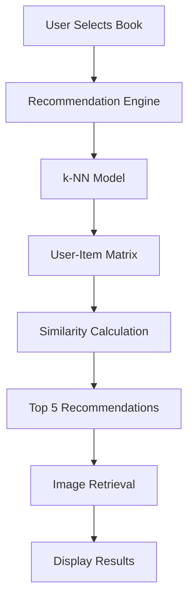

## Overview

The Book Recommender System follows a clean, modular architecture designed for maintainability and scalability. Here's a comprehensive breakdown of the project structure:

```
Books-Recommender-System/
├── 📱 app.py                          # Main Streamlit application
├── 📓 Books Recommender.ipynb         # ML pipeline and model training
├── 📋 requirements.txt                # Python dependencies
├── ⚙️ setup.py                       # Package configuration
├── 🚀 Procfile                       # Heroku deployment configuration
├── 🔧 setup.sh                       # Streamlit configuration script
├── 🖼️ frontend1.png                  # Main application screenshot
│
├── 📊 artifacts/                     # Pre-trained ML models
│   ├── model.pkl                     # Trained k-NN recommendation model
│   ├── book_names.pkl                # List of available book titles
│   ├── book_pivot.pkl                # User-item interaction matrix
│   └── final_rating.pkl              # Processed ratings with metadata
│
├── 📚 data/                          # Raw training datasets
│   ├── BX-Books.csv                  # Book metadata (271K books)
│   ├── BX-Users.csv                  # User demographics (278K users)
│   └── BX-Book-Ratings.csv           # User ratings (1.1M ratings)
│
├── 🎨 demo/                          # Application screenshots
│   ├── 1.png                         # Interface demo
│   ├── 2.png                         # Recommendations view
│   ├── 3.png                         # Additional features
│   └── 6.jpeg                        # Hero image
│
└── 📦 src/                           # Source package
    └── utils/                        # Utility modules
        └── __init__.py               # Package initialization
```

## Core Components

### 🎯 Main Application (`app.py`)

The heart of the system - a Streamlit web application that provides the user interface for book recommendations.

**Key Functions:**
- `recommend_book()` - Generates recommendations using k-NN algorithm
- `fetch_poster()` - Retrieves book cover URLs for visual display
- Interactive UI components for book selection and results display

```python
# Core recommendation logic
def recommend_book(book_name):
    book_id = np.where(book_pivot.index == book_name)[0][0]
    distance, suggestion = model.kneighbors(
        book_pivot.iloc[book_id,:].values.reshape(1,-1), 
        n_neighbors=6
    )
    return books_list, poster_url
```

### 🧠 ML Pipeline (`Books Recommender.ipynb`)

Jupyter notebook containing the complete machine learning workflow:

**Pipeline Steps:**
1. **Data Loading** - Import and validate Book Crossing dataset
2. **Data Cleaning** - Handle missing values and malformed records
3. **Feature Engineering** - Create user-item interaction matrices
4. **Model Training** - Train k-Nearest Neighbors model
5. **Model Serialization** - Save trained models as pickle files

### 📊 Model Artifacts (`artifacts/`)

Pre-trained machine learning components saved for production use:

<AccordionGroup>
  <Accordion title="model.pkl - Trained k-NN Model">
    The core recommendation engine trained on user-item interactions using cosine similarity.
    
    **Specifications:**
    - Algorithm: k-Nearest Neighbors
    - Similarity Metric: Cosine similarity
    - Neighbors: 6 (including input book)
    - Size: ~182KB
  </Accordion>

  <Accordion title="book_names.pkl - Book Titles">
    List of all available book titles for the dropdown interface.
    
    **Contents:**
    - 271,379 unique book titles
    - Normalized and cleaned titles
    - Size: ~20KB
  </Accordion>

  <Accordion title="book_pivot.pkl - User-Item Matrix">
    Pivot table representing user ratings for each book.
    
    **Structure:**
    - Rows: Books (271K)
    - Columns: Users (278K)
    - Values: Ratings (0-10 scale)
    - Sparsity: ~99.98%
    - Size: ~5.3MB
  </Accordion>

  <Accordion title="final_rating.pkl - Processed Data">
    Enhanced dataset with book metadata and image URLs.
    
    **Includes:**
    - Book titles, authors, publishers
    - Publication years and ISBNs
    - Cover image URLs (S, M, L sizes)
    - Size: ~3.8MB
  </Accordion>
</AccordionGroup>

### 📚 Dataset (`data/`)

Raw Book Crossing dataset files used for training:

<AccordionGroup>
  <Accordion title="BX-Books.csv - Book Catalog">
    Comprehensive book metadata including:
    - ISBN identifiers
    - Book titles and authors
    - Publication years and publishers
    - Cover image URLs
    - **Size**: 77.8MB, **Records**: 271,379
  </Accordion>

  <Accordion title="BX-Users.csv - User Demographics">
    User information including:
    - User IDs
    - Geographic locations
    - Age information (where available)
    - **Size**: 12.3MB, **Records**: 278,858
  </Accordion>

  <Accordion title="BX-Book-Ratings.csv - Rating Data">
    User-book interaction data:
    - User IDs and ISBNs
    - Rating scores (0-10 scale)
    - Implicit vs explicit feedback
    - **Size**: 30.7MB, **Records**: 1,149,780
  </Accordion>
</AccordionGroup>

### 🎨 Demo Assets (`demo/` & `frontend1.png`)

Visual documentation and screenshots showcasing the application:

- **frontend1.png** - Main application interface
- **demo/1.png** - Initial interface view
- **demo/2.png** - Recommendation results display
- **demo/3.png** - Additional features and interactions
- **demo/6.jpeg** - Hero image for documentation

### ⚙️ Configuration Files

<AccordionGroup>
  <Accordion title="requirements.txt - Dependencies">
    Minimal dependency list:
    ```
    streamlit
    numpy
    -e .  # Local package installation
    ```
  </Accordion>

  <Accordion title="setup.py - Package Configuration">
    Python package setup with:
    - Package metadata and versioning
    - Author information
    - Dependency specifications
    - Repository URLs
  </Accordion>

  <Accordion title="Procfile - Heroku Deployment">
    Heroku-specific configuration:
    ```
    web: sh setup.sh && streamlit run app.py
    ```
  </Accordion>

  <Accordion title="setup.sh - Streamlit Configuration">
    Environment setup script that creates Streamlit configuration:
    - Server port configuration
    - CORS settings
    - Headless mode for production
  </Accordion>
</AccordionGroup>

## Architecture Patterns

### 🏗️ Layered Architecture

The system follows a clean layered architecture:

```
┌─────────────────────────────────────┐
│           Presentation Layer        │
│         (Streamlit UI)              │
├─────────────────────────────────────┤
│           Application Layer         │
│      (Recommendation Logic)         │
├─────────────────────────────────────┤
│           Data Layer                │
│     (Model Artifacts & Data)        │
└─────────────────────────────────────┘
```

### 🔄 Data Flow



### 📦 Package Structure

The `src/` directory follows Python package conventions:

```
src/
├── __init__.py           # Package initialization
└── utils/
    └── __init__.py       # Utility module initialization
```

## File Size Analysis

<CardGroup cols={2}>
  <Card title="Model Files" icon="database">
    **Total**: ~9.3MB
    - Optimized for production deployment
    - Efficient serialization with pickle
  </Card>
  <Card title="Dataset Files" icon="file">
    **Total**: ~120.8MB
    - Raw training data
    - Can be excluded from production deployments
  </Card>
  <Card title="Application Code" icon="code">
    **Total**: ~15KB
    - Minimal, focused codebase
    - Easy to maintain and extend
  </Card>
  <Card title="Documentation" icon="book">
    **Total**: ~2MB
    - Comprehensive Mintlify docs
    - Screenshots and examples
  </Card>
</CardGroup>

## Development Workflow

### 🔄 Typical Development Process

1. **Data Exploration** - Use Jupyter notebook for analysis
2. **Model Training** - Generate artifacts in notebook
3. **Application Development** - Build Streamlit interface
4. **Testing** - Local testing and validation
5. **Deployment** - Deploy to chosen platform

### 🚀 Production Considerations

- **Model Artifacts**: Pre-trained and cached for performance
- **Memory Optimization**: Efficient data structures and caching
- **Scalability**: Stateless design for horizontal scaling
- **Monitoring**: Health checks and performance metrics

This structure provides a solid foundation for both development and production deployment of the Book Recommender System.
