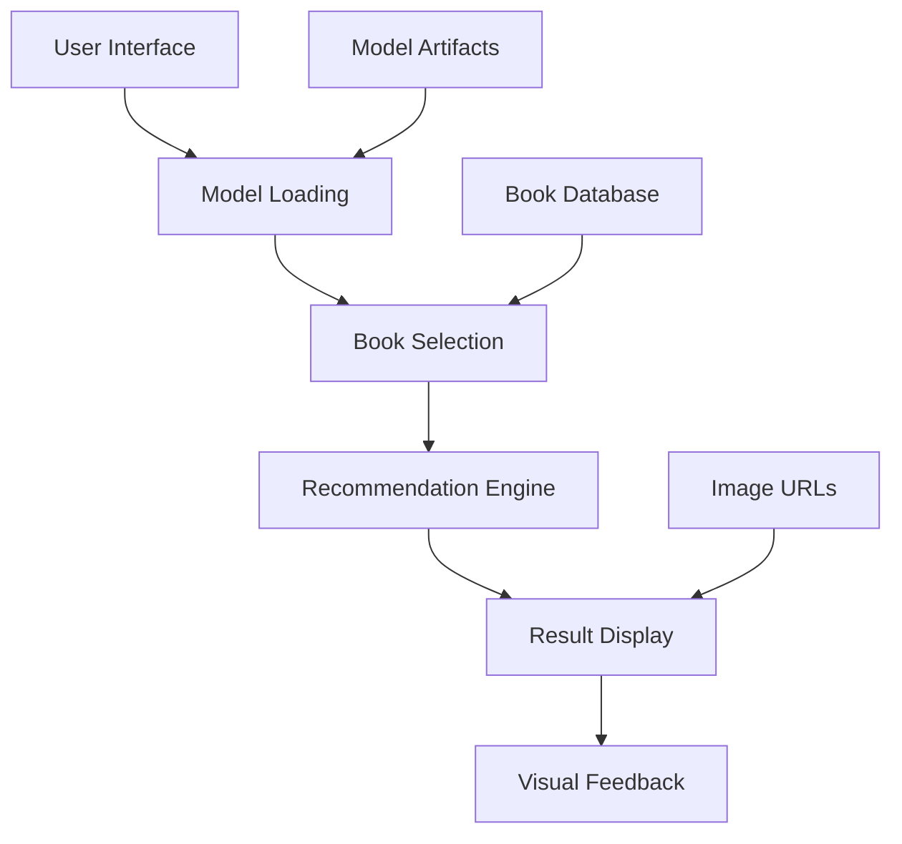

## Streamlit Application Overview

The Book Recommender System is built using **Streamlit**, a powerful Python framework for creating interactive web applications. The app provides an intuitive interface for users to discover new books through AI-powered recommendations.

## 🏗️ Application Architecture



## 📱 Core Application Structure

### Main Application File (`app.py`)

The application is contained in a single, focused Python file with clear separation of concerns:

```python
'''
Book Recommender System - Streamlit Application
'''

import pickle
import streamlit as st
import numpy as np

# Model loading and initialization
# Recommendation functions
# User interface components
# Result display logic
```

## 🔧 Key Components

### 1. Model Loading & Initialization

The application loads pre-trained models at startup for optimal performance:

```python
# Load all required model artifacts
model = pickle.load(open('artifacts/model.pkl','rb'))
book_names = pickle.load(open('artifacts/book_names.pkl','rb'))
final_rating = pickle.load(open('artifacts/final_rating.pkl','rb'))
book_pivot = pickle.load(open('artifacts/book_pivot.pkl','rb'))
```

<AccordionGroup>
  <Accordion title="Model Artifacts">
    - **model.pkl**: Trained k-NN recommendation model
    - **book_names.pkl**: List of available book titles for dropdown
    - **final_rating.pkl**: Processed ratings with metadata and image URLs
    - **book_pivot.pkl**: User-item interaction matrix for recommendations
  </Accordion>

  <Accordion title="Performance Optimization">
    - Models loaded once at startup
    - Cached in memory for fast access
    - Optimized data structures for quick lookups
    - Minimal memory footprint
  </Accordion>
</AccordionGroup>

### 2. Recommendation Engine

The core recommendation logic is encapsulated in two main functions:

<AccordionGroup>
  <Accordion title="fetch_poster() Function">
    ```python
    def fetch_poster(suggestion):
        """Retrieve book cover URLs for recommended books"""
        book_name = []
        ids_index = []
        poster_url = []

        for book_id in suggestion:
            book_name.append(book_pivot.index[book_id])

        for name in book_name[0]: 
            ids = np.where(final_rating['title'] == name)[0][0]
            ids_index.append(ids)

        for idx in ids_index:
            url = final_rating.iloc[idx]['image_url']
            poster_url.append(url)

        return poster_url
    ```
    
    **Purpose**: Fetches book cover image URLs for visual display
  </Accordion>

  <Accordion title="recommend_book() Function">
    ```python
    def recommend_book(book_name):
        """Generate book recommendations using k-NN collaborative filtering"""
        books_list = []
        book_id = np.where(book_pivot.index == book_name)[0][0]
        distance, suggestion = model.kneighbors(
            book_pivot.iloc[book_id,:].values.reshape(1,-1), 
            n_neighbors=6
        )

        poster_url = fetch_poster(suggestion)
        
        for i in range(len(suggestion)):
            books = book_pivot.index[suggestion[i]]
            for j in books:
                books_list.append(j)
                
        return books_list, poster_url
    ```
    
    **Purpose**: Core recommendation algorithm using k-NN
  </Accordion>
</AccordionGroup>

### 3. User Interface Components

The Streamlit interface provides an intuitive user experience:

<AccordionGroup>
  <Accordion title="Application Header">
    ```python
    st.header('Book Recommender System Using Machine Learning')
    ```
    Clear branding and system identification
  </Accordion>

  <Accordion title="Book Selection Interface">
    ```python
    selected_books = st.selectbox(
        "Type or select a book from the dropdown",
        book_names
    )
    ```
    - Dropdown with thousands of book titles
    - Type-ahead search functionality
    - User-friendly selection interface
  </Accordion>

  <Accordion title="Recommendation Trigger">
    ```python
    if st.button('Show Recommendation'):
        # Generate and display recommendations
    ```
    - Clear call-to-action button
    - Triggers recommendation generation
    - Provides user feedback
  </Accordion>
</AccordionGroup>

### 4. Results Display

The application presents recommendations in a visually appealing layout:

```python
if st.button('Show Recommendation'):
    recommended_books, poster_url = recommend_book(selected_books)
    col1, col2, col3, col4, col5 = st.columns(5)
    
    with col1:
        st.text(recommended_books[1])
        st.image(poster_url[1])
    with col2:
        st.text(recommended_books[2])
        st.image(poster_url[2])
    # ... continues for all 5 recommendations
```

<CardGroup cols={2}>
  <Card title="Grid Layout" icon="grid">
    Organized display in 5 columns for easy browsing
  </Card>
  <Card title="Visual Elements" icon="image">
    Book covers displayed alongside titles
  </Card>
  <Card title="Clean Typography" icon="text">
    Clear, readable book titles
  </Card>
  <Card title="Responsive Design" icon="mobile">
    Adapts to different screen sizes
  </Card>
</CardGroup>

## 🎨 User Experience Design

### Interface Features

<AccordionGroup>
  <Accordion title="Intuitive Navigation">
    - **Single-page design** for simplicity
    - **Clear visual hierarchy** with headers and sections
    - **Minimal cognitive load** with focused functionality
    - **Immediate feedback** with loading states
  </Accordion>

  <Accordion title="Visual Appeal">
    - **Book cover images** for enhanced visual experience
    - **Clean, modern design** following UI best practices
    - **Consistent spacing** and typography
    - **Professional color scheme** with Streamlit defaults
  </Accordion>

  <Accordion title="Accessibility">
    - **Keyboard navigation** support
    - **Screen reader compatibility** with proper labels
    - **High contrast** text and backgrounds
    - **Responsive layout** for various devices
  </Accordion>
</AccordionGroup>

### Performance Characteristics

<CardGroup cols={2}>
  <Card title="Fast Loading" icon="bolt">
    Models pre-loaded for instant recommendations
  </Card>
  <Card title="Smooth Interactions" icon="play">
    Responsive UI with minimal delays
  </Card>
  <Card title="Memory Efficient" icon="memory">
    Optimized data structures and caching
  </Card>
  <Card title="Scalable Design" icon="expand">
    Stateless architecture for horizontal scaling
  </Card>
</CardGroup>

## 🔧 Configuration & Customization

### Streamlit Configuration

The application uses several configuration files:

<AccordionGroup>
  <Accordion title="setup.sh - Streamlit Config">
    ```bash
    mkdir -p ~/.streamlit/

    echo "\
    [server]\n\
    port = $PORT\n\
    enableCORS = false\n\
    headless = true\n\
    " > ~/.streamlit/config.toml
    ```
    Production-ready Streamlit configuration
  </Accordion>

  <Accordion title="Custom Configuration">
    ```toml
    # .streamlit/config.toml
    [server]
    port = 8501
    enableCORS = false
    enableWebsocketCompression = true

    [theme]
    primaryColor = "#0D9373"
    backgroundColor = "#FFFFFF"
    secondaryBackgroundColor = "#F0F2F6"
    textColor = "#262730"
    ```
    Customizable theme and server settings
  </Accordion>
</AccordionGroup>

### Environment Variables

Support for environment-based configuration:

```python
import os

# Configuration from environment
DEBUG = os.getenv('DEBUG', 'False').lower() == 'true'
MODEL_PATH = os.getenv('MODEL_PATH', 'artifacts/')

# Conditional features based on environment
if DEBUG:
    st.sidebar.text("Debug mode enabled")
    st.sidebar.json({
        "Model loaded": model is not None,
        "Books available": len(book_names),
        "Matrix shape": book_pivot.shape
    })
```

## 🚀 Deployment Considerations

### Production Optimization

<AccordionGroup>
  <Accordion title="Performance Tuning">
    ```python
    # Use Streamlit caching for expensive operations
    @st.cache_data
    def load_model_artifacts():
        model = pickle.load(open('artifacts/model.pkl', 'rb'))
        return model
    
    # Cache recommendations for popular books
    @st.cache_data(ttl=3600)  # Cache for 1 hour
    def get_cached_recommendations(book_name):
        return recommend_book(book_name)
    ```
  </Accordion>

  <Accordion title="Error Handling">
    ```python
    try:
        recommended_books, poster_url = recommend_book(selected_books)
    except Exception as e:
        st.error(f"Error generating recommendations: {str(e)}")
        st.info("Please try selecting a different book.")
    ```
  </Accordion>

  <Accordion title="Security Considerations">
    - **Input validation** for book selection
    - **Error sanitization** to prevent information leakage
    - **Rate limiting** for production deployments
    - **HTTPS enforcement** for secure connections
  </Accordion>
</AccordionGroup>

### Monitoring & Analytics

```python
# Simple usage tracking (for development)
if 'usage_log' not in st.session_state:
    st.session_state.usage_log = []

if st.button('Show Recommendation'):
    st.session_state.usage_log.append({
        'timestamp': datetime.now(),
        'book_selected': selected_books,
        'recommendations_generated': True
    })
    
    # Track recommendation success
    st.success(f"Generated recommendations for: {selected_books}")
```

## 🛠️ Development & Testing

### Local Development

<Steps>
  <Step title="Start Development Server">
    ```bash
    streamlit run app.py
    ```
  </Step>

  <Step title="Enable Hot Reloading">
    Streamlit automatically reloads when files change
  </Step>

  <Step title="Debug Mode">
    ```bash
    DEBUG=true streamlit run app.py
    ```
    Enables additional debugging information
  </Step>
</Steps>

### Testing Strategy

<AccordionGroup>
  <Accordion title="Unit Testing">
    ```python
    def test_recommend_book():
        """Test recommendation function"""
        test_book = "Harry Potter and the Philosopher's Stone"
        recommendations, posters = recommend_book(test_book)
        
        assert len(recommendations) == 6  # Including input book
        assert len(posters) == 6
        assert test_book in recommendations
    ```
  </Accordion>

  <Accordion title="Integration Testing">
    ```python
    def test_full_pipeline():
        """Test complete recommendation pipeline"""
        # Test model loading
        assert model is not None
        assert len(book_names) > 0
        
        # Test recommendation generation
        test_recommendations = recommend_book(book_names[0])
        assert len(test_recommendations[0]) > 0
    ```
  </Accordion>
</AccordionGroup>

## 📈 Future Enhancements

### Planned Improvements

<CardGroup cols={2}>
  <Card title="Enhanced UI" icon="palette">
    - Multiple recommendation modes
    - Advanced filtering options
    - User preference profiles
  </Card>
  <Card title="Performance" icon="bolt">
    - Async recommendation generation
    - Advanced caching strategies
    - Real-time model updates
  </Card>
  <Card title="Analytics" icon="chart">
    - User behavior tracking
    - Recommendation effectiveness metrics
    - A/B testing framework
  </Card>
  <Card title="Mobile Support" icon="mobile">
    - Responsive design improvements
    - Touch-optimized interactions
    - Progressive Web App features
  </Card>
</CardGroup>

The Streamlit application provides a robust, user-friendly interface for the Book Recommender System, combining sophisticated machine learning capabilities with intuitive design for an exceptional user experience.
